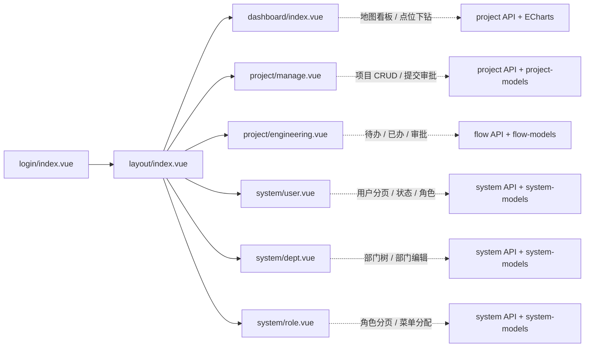
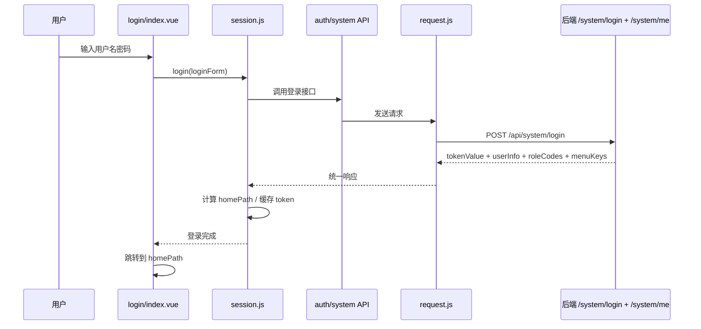
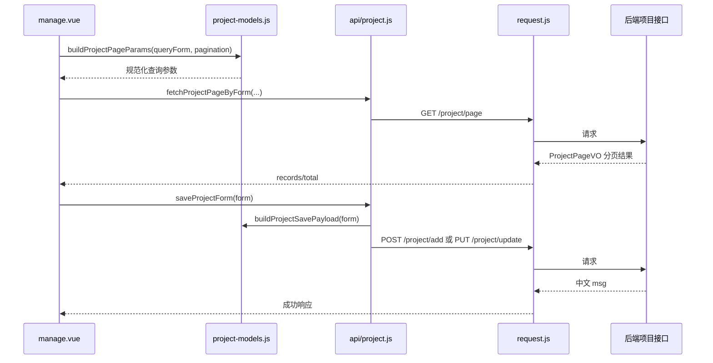
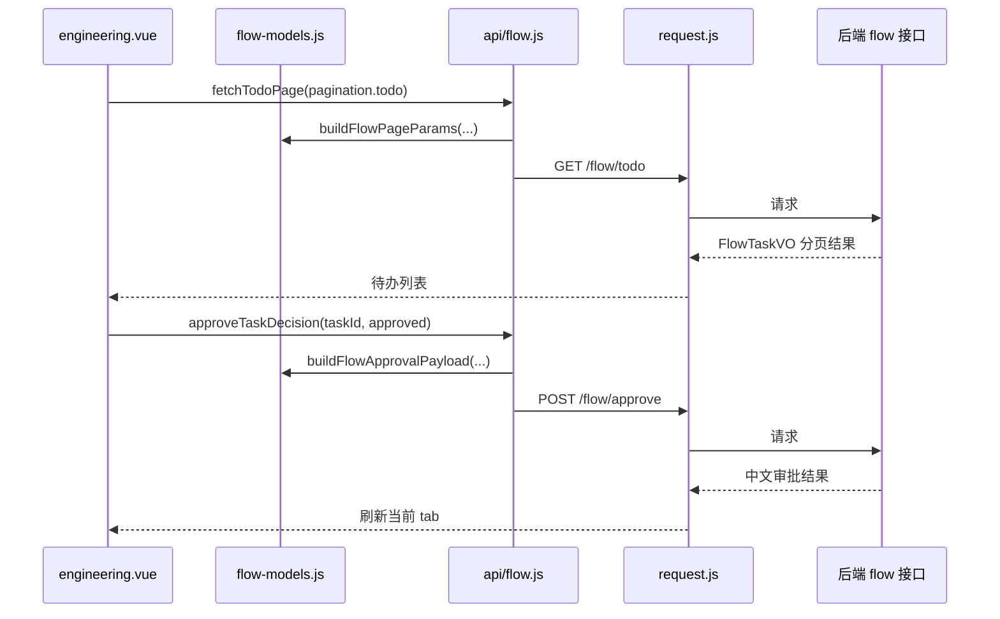

# 前端架构总览

## 1. 整体分层图

```mermaid
flowchart TD
    A[浏览器 / 用户操作] --> B[Vue 3 应用入口 main.js]
    B --> C[Vue Router 路由系统]
    B --> D[Pinia Session Store]
    B --> E[Layout 布局壳层]

    C --> C1[登录页]
    C --> C2[首页地图看板]
    C --> C3[项目管理]
    C --> C4[审批中心]
    C --> C5[用户管理]
    C --> C6[部门管理]
    C --> C7[角色管理]

    D --> D1[用户信息 userInfo]
    D --> D2[角色码 roleCodes]
    D --> D3[菜单权限 menuKeys]
    D --> D4[homePath 首屏落点]

    C3 --> F1[project-models.js]
    C4 --> F2[flow-models.js]
    C5 --> F3[system-models.js]
    C6 --> F3
    C7 --> F3

    C1 --> G[api/*.js 业务 API 封装]
    C2 --> G
    C3 --> G
    C4 --> G
    C5 --> G
    C6 --> G
    C7 --> G

    G --> H[request.js Axios 实例]
    H --> H1[请求拦截: 注入 Authorization]
    H --> H2[响应拦截: 统一处理 code/msg]
    H --> H3[feedback.js 统一中文提示]
    H --> I[/api 后端接口]
```

## 2. 页面与职责图



## 3. 核心目录职责

```text
src/
├─ api/
│  ├─ project.js      项目相关接口与业务动作封装
│  ├─ flow.js         审批流接口与分页/审批动作封装
│  ├─ system.js       用户/部门/角色接口与业务动作封装
│  └─ auth.js         认证相关接口
├─ layout/
│  └─ index.vue       左侧菜单 + 顶层壳层 + 退出登录
├─ router/
│  └─ index.js        路由定义、登录守卫、菜单权限守卫
├─ stores/
│  └─ session.js      登录、/me、角色/菜单标准化、homePath
├─ utils/
│  ├─ request.js      Axios 统一请求层
│  ├─ feedback.js     成功/失败/确认框统一中文提示
│  ├─ project-models.js 项目页表单/查询/提交模型适配
│  ├─ system-models.js 用户/部门/角色模型适配
│  └─ flow-models.js  审批分页/审批动作模型适配
└─ views/
   ├─ login/          登录页
   ├─ dashboard/      地图看板
   ├─ project/        项目管理、审批中心
   └─ system/         用户、部门、角色管理
```

## 4. 关键运行链路

### 登录链路



### 项目管理链路



### 审批中心链路



## 5. 当前前端的关键约束

- 权限来源以 `menuKeys` 为主，角色码只作为补充判断。
- 登录后直接按 `homePath` 落到可访问首页，不再固定先跳 `/dashboard`。
- 页面层尽量不直接拼 payload，而是通过 `api/*.js + utils/*-models.js` 统一收口。
- 所有接口消息由 `request.js + feedback.js` 统一处理中文提示。
- 地图页是唯一引入 ECharts 的核心页面，非地图页面通过 chunk 切分避免额外运行时负担。
